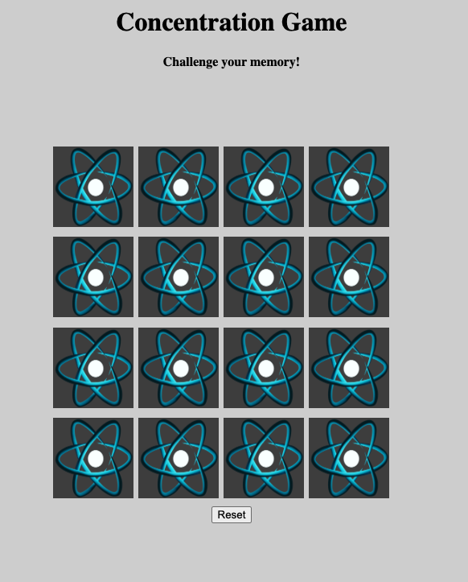
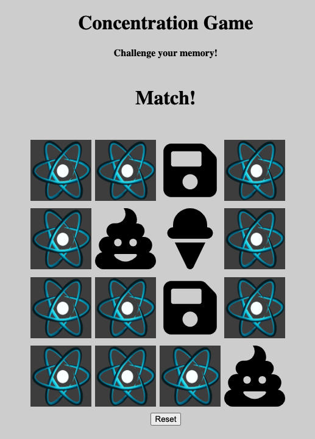

# Concentration-Game

[GAME LINK](capable-semifreddo-5fbf3c.netlify.app)

[--Wireframe link--](https://whimsical.com/concentration-game-5265hYtTQMcXMsGcaeERF4@2Ux7TurymND9W9Zg5DQ9)

[--Pseudo code link--](https://docs.google.com/document/d/1UxDKur2-RvQeKXYVvmFk5OAPOKE9MGswL-u-3QmGtPw/edit?usp=sharing)

####Welcome to Concentration! 

In this game the player will encounter a board with cards facing down, the goal is to try matching two of the same cards. If cards are a match, the cards will stay facing up. Otherwise, cards will flip-over again.  

The goal, is for the player to memorize the position of the cards and match all alike cards, while flipping the least number of cards. Therefore, forcing your memory to recall the card position.

Future enhancements:
* Include courter showing number of right and wrong picks.
* Option on turn on/off sound effects.

Technologies Used: HTML, CSS, JAVASCRIPT. 

